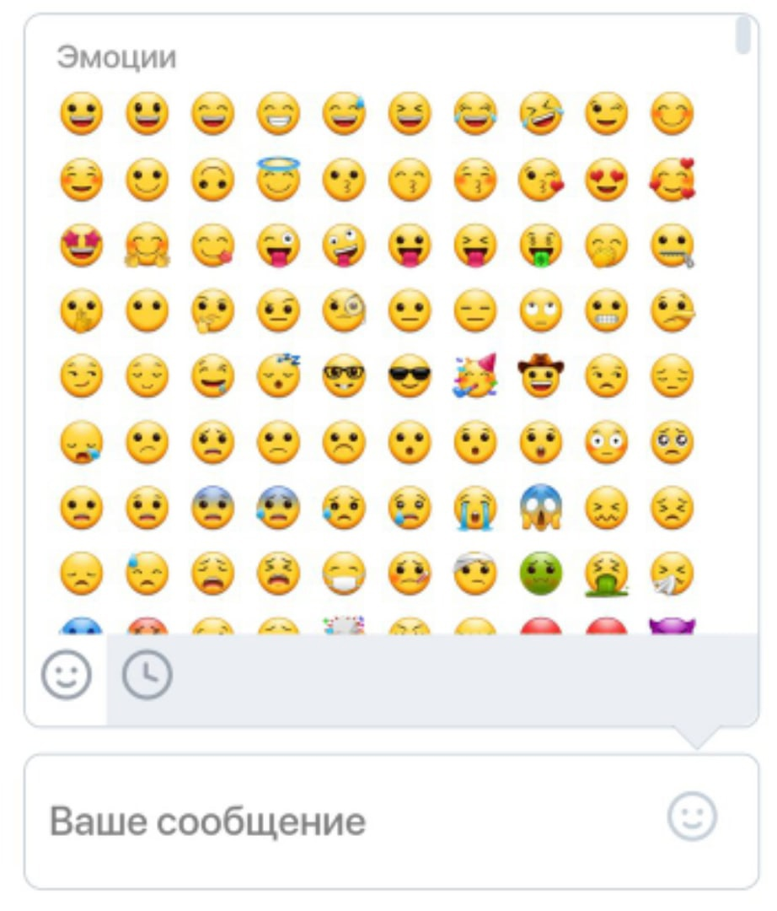
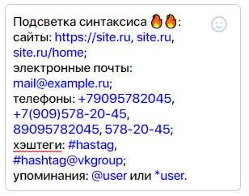

# VKEmojiKeyboard

Веб-приложение представляет собой поле ввода с интерфейсом для добавления emoji.

> Приложение написано с помощью HTML, CSS, JavaScript. Без применения фреймворков.

### Особенности

* поле ввода изменяет размер в зависимости от объёма текста (max высота 250px, потом появляется scrollbar);
* при нажатии на иконку справа открывается выпадающий интерфейс выбора emoji;
* интерфес выбора emoji позволяет выбирать между всем списком и списком последних использованных emoji (25);
* при наведении на смайлик на клавиатуре, он подсвечивается;
* изменён дизайн scrollbar в соответствии с макетом (работает не во всех браузерах);
* адаптировано под мобильные устройства (Android);
* разработано управление с клавиатуры;
* реализована подсветка синтаксиса (ссылок, хэштегов и т.п.).

### Управление с клавиатуры

* автоматический фокус на поле ввода при печати с клавиатуры;
* клавиша `Tab` открывает/закрывает emoji-клавиатуру;
* `Enter` - переход на новую строку;
* `Ctrl + Enter` - имитация отправки сообщения.

### Подсветка синтаксиса

С помощью регулярных выражений настроена подсветка синтаксиса в поле ввода. Приложение распознаёт:

* сайты: `https://site.ru`, `site.ru`, `site.ru/home`;
* электронные почты: `mail@example.ru`;
* телефоны: `+79095782045`, `+7(909)578-20-45`, `89095782045`, `578-20-45`;
* хэштеги: `#hastag`, `#hashtag@vkgroup`;
* упоминания: `@user` или `*user`.

## Результат

Приложение расположено на хостинге `Heroku`: https://vkemojikeyboard.herokuapp.com/index.html